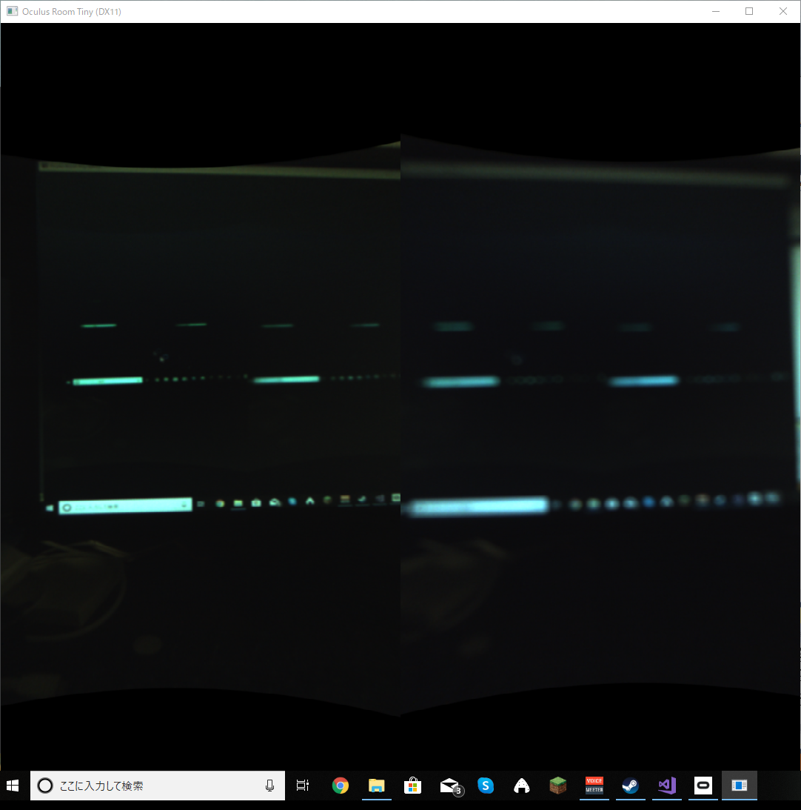

# MyTestVR_App
## 概要
Oculus Rift (s)と専用カメラのOvrivisionProを用いて,OvrivisionProから取得したリアルタイム映像をOculus上で視聴するソフトです。
## 動作環境
- Windows10 64bit
- Direct3DX11
## 開発環境
- Visual Studio 2017
- OvrvisionSDK 1.4
- OculusSDK 1.8
## 使用方法
1. ソフトのダウンロード https://1drv.ms/u/s!ArNbpC7I1GPWgs9c9HqHDqAuWsXwzQ?e=ur8uhb
2. Oculus RIftとOvrivisionをパソコンにつなげる
3. ソフトの起動
4. Ovrivisionで取得しているリアルタイム映像がOculus上で見れます.

